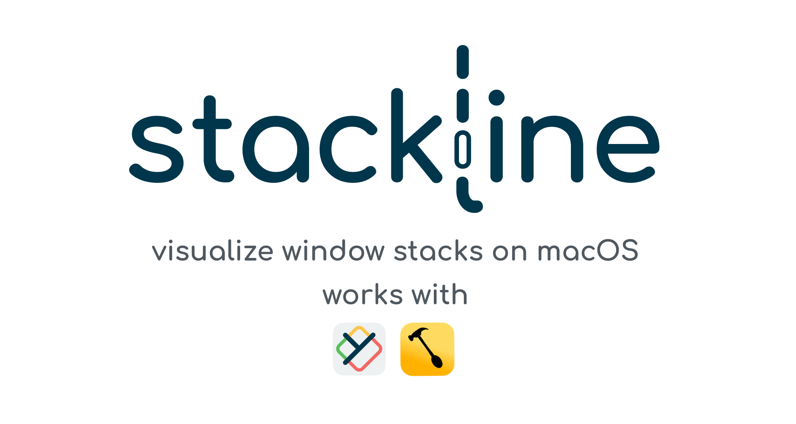
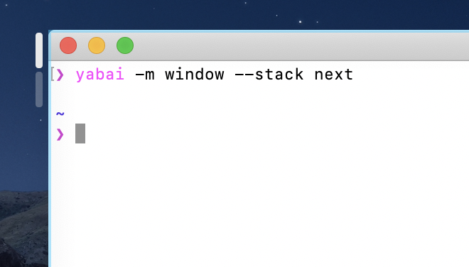
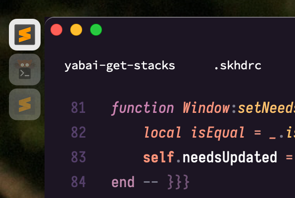

<p>
  
  <a href="#" target="_blank">
    
  </a>
</p>

> Visualize yabai window stacks on macOS. Works with yabai & hammerspoon.

## ⚠️  WARNING: THIS IS A PROOF-OF-CONCEPT

Currently, [stackline](https://github.com/AdamWagner/stackline) is a proof-of-concept for visualizing the total number and status of stacked windows. Feel free to try it out and open [issues](https://github.com/AdamWagner/stackline/issues) / PRs, but using stackline full-time is not recommended (yet).

There is much crucial fuctionality that is either missing or broken. For example, stack indicators do not refresh when:

1. the tree is rotated or mirrored

## What is stackline & why do I need it?

Consider a browser window with many tabs.

A tabbed user interface consists of a collection of windows that occupy the same screen space. Only _one_ tabbed window may be visible at any given time, and it's the user's job to specify the 'active' window.

To enable this task, tabbed interfaces provide visual indicators for each tab, each occupying much less space than the tab it references, which enables all indicators to be visible at all times. Each indicator _identifies the contents of a window_ & _communicates its position relative to the active window_.

A 'stack' provides a generalized subset of the functionality provided by tabbed user interfaces: it enables multiple to windows to occupy the same screen space, and provides mechanisms to navigate its member windows. It also provides mechanisms to add & remove windows from the stack.

Critically for stackline, a 'stack' does not provide the visual indicators necessary to identify how many windows belong to a stack or understand the relative position of the active window within the stack.

Stacks are a recent addition (June 2020) to the (_excellent!_) macOS tiling window manager [koekeishiya/yabai,](https://github.com/koekeishiya/yabai,) and visualization UI is not yet in-the-box.

Enter stackline, which adds non-obtrusive visual indicators to yabai's stacking functionality.


## Getting started with stackline

**Prerequisites**

1. https://github.com/koekeishiya/yabai ([install guide](http://https://github.com/koekeishiya/yabai/wiki/Installing-yabai-(latest-release)))
2. https://github.com/Hammerspoon/hammerspoon ([getting started guide](https://www.hammerspoon.org/go/))
3. https://github.com/stedolan/jq (`brew install jq`)


You're free to bind yabai commands using your favorite key remapper tool
(skhd, karabiner elements, and even hammerspoon are all viable options).

That said, you're _probably_ using https://github.com/koekeishiya/skhd. If so,
now is a good time to map keys for navigating and manipulating yabai stacks.

```sh
# Focus window up/down in stack
ctrl - n : yabai -m window --focus stack.next
ctrl - p : yabai -m window --focus stack.prev

# Add the active window  to the window or stack to the {direction}
# Note that this only works when the active window does *not* already belong to a stack
cmd + ctrl - left  : yabai -m window west --stack $(yabai -m query --windows --window | jq -r '.id')
cmd + ctrl - down  : yabai -m window south --stack $(yabai -m query --windows --window | jq -r '.id')
cmd + ctrl - up    : yabai -m window north --stack $(yabai -m query --windows --window | jq -r '.id')
cmd + ctrl - right : yabai -m window east --stack $(yabai -m query --windows --window | jq -r '.id')
```

### Installing stackline

1. Clone the repo into ~/.hammerspoon/stackline
2. Add stackline to your Hammerspoon init.lua file
3. Add signals to ~/.yabairc

#### 1. Clone the repo into ~/.hammerspoon/stackline

```sh
git clone https://github.com/AdamWagner/stackline.git ~/.hammerspoon/stackline
```

#### 2. Add stackline to your Hammerspoon init.lua file

```sh
cd ~/.hammerspoon
echo 'require("hs.ipc")' >> init.lua
echo 'hs.ipc.cliInstall()' >> init.lua
echo 'require "stackline.stackline.core"' >> init.lua
```

Now your `~/.hammerspoon` directory should look like this:

```
├── init.lua
├── stackline
│  ├── bin
│  │  └── yabai-get-stacks
│  │  └── yabai-add-signals
│  ├── stackline
│  │  ├── core.lua
│  │  ├── stack.lua
│  │  └── window.lua
│  └── utils
│     ├── flatten.lua
│     ├── table-utils.lua
│     ├── underscore.lua
│     └── utils.lua
├── …
```


#### 3. Add signals to ~/.yabairc

```sh
echo '$HOME/.hammerspoon/stackline/yabai-add-signals' >> ~/.yabairc
```

### RETRO? GO! FIDO? GO! GUIDANCE…

We're almost there!

```sh
# Launch yabai (or make sure it's running)
brew services start yabai

# Launch hammerspoon (or make sure it's running)
open -a "Hammerspoon"
```

Now, assuming you've been issuing these commands from a terminal and _also_ have a browser window open  on the same space, make sure your terminal is positioned immediately to the _left_ of Safari and issue the following command:

```sh
yabai -m window --stack next
```

Did the terminal window expand to cover the area previously occupied by Safari? Great! At this point, you should notice **two pill-shaped vertical blobs just left of the top-left corner of your terminal window**, like this:



The default stack indicator style is a "pill" as seen ↑
To toggle icons:

```sh
 echo ":toggle_icons:1" | hs -m stackline-config
```



Image (and feature!) courtesy of [@alin23](https://github.com/alin23).

## Help us get to v1.0.0!

Give a ⭐️ if you think (a fully functional version of) stackline would be useful!


## Thanks to contributors!

All are welcome (actually, _please_ help us, 🤣️)! Feel free to dive in by opening an [issue](https://github.com/AdamWagner/stackline/issues/new) or submitting a PR.

[@AdamWagner](https://github.com/AdamWagner) wrote the initial proof-of-concept (POC) for stackline.

[@alin23](https://github.com/alin23), initially proposed the [concept for stackline here](https://github.com/koekeishiya/yabai/issues/203#issuecomment-652948362) and encouraged [@AdamWagner](https://github.com/AdamWagner) to share this mostly-broken POC publicly.

- After [@alin23](https://github.com/alin23)'s https://github.com/AdamWagner/stackline/pull/13, stackline sucks a lot less.

Thanks to [@johnallen3d](https://github.com/johnallen3d) for being one the first folks to install stackline, and for identifying several mistakes & gaps in the setup instructions. 

[@zweck](https://github.com/zweck), who, [in the same thread](https://github.com/koekeishiya/yabai/issues/203#issuecomment-656780281), got the gears turning about how [@alin23](gh-alin23)'s idea could be implemented and _also_ urged Adam to share his POC.

### …on the shoulders of giants
Thanks to [@koekeishiya](gh-koekeishiya) without whom the _wonderful_ [yabai](https://github.com/koekeishiya/yabai) would not exist, and projects like this would have no reason to exist.

Similarly, thanks to [@dominiklohmann](https://github.com/dominiklohmann), who has helped _so many people_ make chunkwm/yabai "do the thing" they want and provides great feedback on new and proposed yabai features.

Finally, thanks to [@cmsj](https://github.com/cmsj), [@asmagill](https://github.com/asmagill), and all of the contributors to [hammerspoon](https://github.com/Hammerspoon/hammerspoon) for opening up macOS APIs to all of us!

## License & attribution
stackline is licensed under the [&nearr;&nbsp;MIT&nbsp;License](stackline-license), the same license used by [yabai](https://github.com/koekeishiya/yabai/blob/master/LICENSE.txt) and [hammerspoon](https://github.com/Hammerspoon/hammerspoon/blob/master/LICENSE).

MIT is a simple permissive license with conditions only requiring preservation of copyright and license notices. Licensed works, modifications, and larger works may be distributed under different terms and without source code.

[MIT](LICENSE) © Adam Wagner

